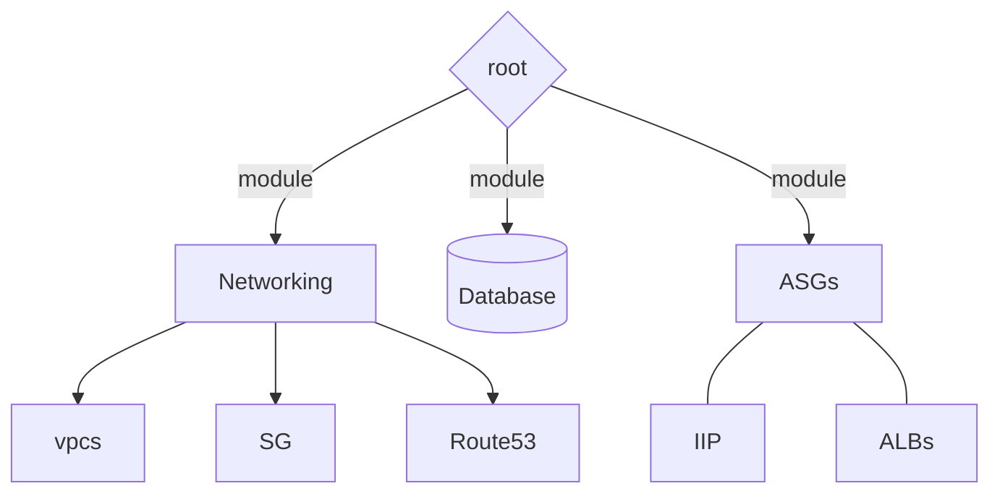

# terraform modules architecture 

## step 1: init terraform cloud
#### **`terraform.tf`**
```
terraform {
  cloud {
    organization = "pvmtriet"
    # hostname = "app.terraform.io"

    workspaces {
      name = "infras"
    }
  }
}
```
## step 2: 
- add 


